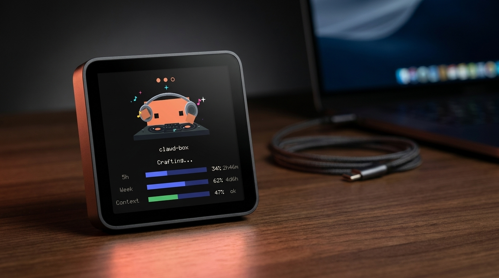
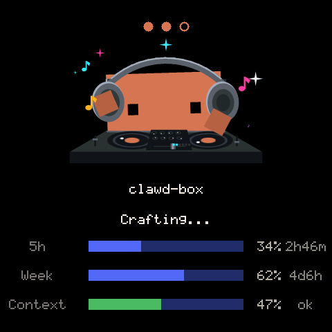
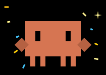
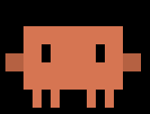
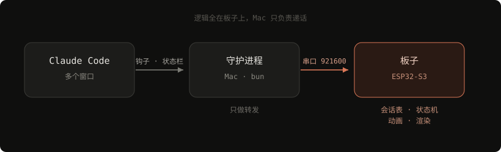

<div align="center">



# Clawd Box

一块 4 寸触摸屏，放在桌上告诉你代码写得怎么样了。

谁在跑、跑完没有、还剩多少额度，抬眼就看得见，不用切窗口。

</div>

---

## 屏幕上是什么



上面那张宣传图是概念渲染，右边这张是板子的真实画面，480×480，一个像素没改。

- 顶上一排点是子任务，实心的跑完了，空心的还在跑
- 中间是 Clawd，正在打碟
- 下面是项目名和当前动作
- 最下面三根条：5 小时额度、7 天额度、上下文用量，各自带重置倒计时

<br clear="right">

## 它会做的动作

<table>
<tr>
<td width="25%" align="center"><br><b>干完了</b><br><sub>蹦起来撒彩纸</sub></td>
<td width="25%" align="center"><br><b>等你回话</b><br><sub>举着灯泡抖</sub></td>
<td width="25%" align="center"><br><b>闲着</b><br><sub>左右张望</sub></td>
<td width="25%" align="center"><br><b>睡着了</b><br><sub>鼻涕泡一鼓一破</sub></td>
</tr>
</table>

状态是用动作演的，不是换图标。扫一眼看姿势就知道在干嘛，不用读字。

同时开几个项目时会在它们之间轮播；只有一个在忙就锁定那个。干完了会响一声。

## 上手

要装 [ESP-IDF v5.5](https://docs.espressif.com/projects/esp-idf/zh_CN/latest/esp32s3/get-started/) 和 [bun](https://bun.sh)，硬件是微雪 ESP32-S3-Touch-LCD-4B。

```bash
git clone https://github.com/haosenssss/clawd-box && cd clawd-box
```

烧固件：

```bash
cd firmware
idf.py set-target esp32s3
idf.py -p /dev/cu.usbmodem* flash
```

板子有两个 USB 口，插哪个都行。

起守护进程，跑一次就好，之后每次开机会自己起来：

```bash
./host/launchd/install.sh
```

最后在 `~/.claude/settings.json` 里把钩子和状态栏指过来：

```jsonc
{
  "statusLine": {
    "type": "command",
    "command": "bun run /path/to/clawd-box/host/bin/statusline.ts"
  },
  "hooks": {
    // UserPromptSubmit / Stop / Notification / SubagentStart / SubagentStop
    // 五个事件都指向同一个脚本。async 要写 true，它跑在对话的关键路径上。
    "Stop": [{ "hooks": [{
      "type": "command",
      "async": true,
      "command": "bun run /path/to/clawd-box/host/bin/hook.ts"
    }] }]
  }
}
```

插上板子就能看见了。日志在 `/tmp/clawdbox-daemon.log`。

## 怎么搭的

<div align="center">

</div>

Mac 这边只做三件事：读会话列表、确认进程还活着、接住钩子的输入，然后把消息递过去。剩下的都在板子上——谁在跑、演什么动作、翻到哪一页、怎么画。

消息是状态替换式的，每条整个覆盖某个会话的状态，不做事件累积。所以板子上占的内存是会话数乘以定长，跑一整天也不会涨。

数据只有两个来源：Claude Code 自己算出来的额度数值，和它的钩子事件。都是本地读，不额外发网络请求。

## 硬件

| | |
|---|---|
| 主控 | ESP32-S3 · 16 MB flash · 8 MB PSRAM |
| 屏 | ST7701 RGB 480×480 |
| 触摸 | GT911 |
| 音频 | ES8311 + 功放 |
| 扩展 | TCA9554（屏幕复位、背光、SPI 片选都在它后面） |

## 开发

有两个工具不用接板子就能跑。

动效预览，把固件里那份 `clawd.c` 编到本机直接出图。README 里的动图和截图都是它生成的：

```bash
cd firmware
clang -O2 -I main -o /tmp/prev ../tools/preview/preview.c main/sprite/clawd.c -lm
/tmp/prev /tmp/out.raw
```

轮播和抢占逻辑的测试，时间是函数入参，不用等真实时钟：

```bash
./tools/logic-test/run.sh
```

主机侧：

```bash
cd host && bun test
```

---

非官方个人项目。"Claude" 和 "Clawd" 是 Anthropic 的商标，形象归他们所有，本仓库以 [MIT](LICENSE) 开源，只覆盖代码。
